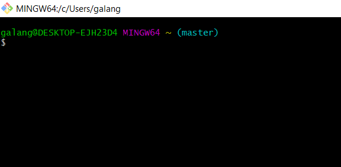

# TUGAS BAHASA PEMROGRAMAN
## Praktikum 1 Fardhilan Galang Priarto

### Instalasi Git

Download Git,buka website resminya Git(git-scm.com).
Kemudian unduh Git Sesuai dengan OS komputer kita
Linux,MacOS,ataupun Windows dapat memilih 64 bit atau 32 bit Git berhasil di install

 


## Menambahkan Global Config
Hal pertama yang sebaiknya Anda lakukan ketika 
memasang Git adalah menetapkan nama pengguna 
dan alamat email. Ini penting, karena setiap 
commit pada Git menggunakan informasi ini, 
dan itu dituliskan dan tidak dapat diganti
ke dalam commit yang Anda buat

```
git config --global user.name "Fardhilan"
git config --global user.email fardhilangalang321@gmail.com

```


## Membuat Repository Local 
Buat Repository Local dengan PRAKTIKUM

```
mkdir /d/Praktikum
cd /d/Praktikum
```


## Menjalankan Git init
Jalankan perintah git init

```
git init
```
## Menambahkan File baru pada repository
Gunakan perintah

```
$ echo "# TUGAS BAHASA PEMROGRAMAN" >>> README.md
```


## Konfirmasi Perubahan File
Untuk menyimpan perubahan menggunakan
```
git commit -m "<pesan commit>"
```

## Membuat Repository Server
Server Repository http://github.com
Setelah Anda mendaftar akun
Pilih menu icon + pilih New repository


## Pengisian Repository Server
Isi sesuai dengan keperluan
lalu Create Repository


## Remote Github
Dengan Perintah
```
git remote add origin https://github.com/Fardhilan/Praktikum-Bahasa-Pemrograman.git
```
Untuk menyimpan ke Repository Server menggunakan 
```
git push -u origin master
```
